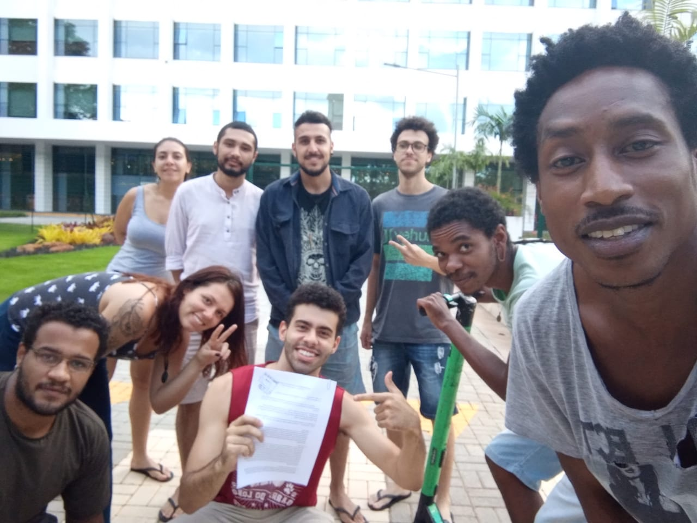

<!-- 
Em href="" colocar dentro das aspas o link 
do arquivo seja no drive ou no próprio github
LEMBRE-SE SEMPRE DE TORNÁ-LO PÚBLICO
-->

## Cartas
<ul>
	<li>Carta ao reitor Vahan Agopyan e gabinete</li>
	**[19/03/2020]** Carta protocolada pelos moradores do Bloco F do CRUSP em meio à quarentena do COVID-19 "por razões de falta de suporte e uma atuação limitada da Superintendência de Assistência Social (SAS) frente a não resolução dos problemas relatados à mesma".
	<ul>
		<li><a href="https://drive.google.com/open?id=1r1KNRLiOqFpINm9027zI-j36EMauxwSM" target="_blank">Carta ao Reitor [alt F4]</a></li>
		

			
		

	</ul>
	<li>Carta à FEA (docentes e diretor Fábio Frezatti)</li>
**[19/03/2020]** Carta aberta assinada por 11 discentes e moradores do CRUSP em meio à quarentena do COVID-19 "por objetivo elucidar a real situação enfrentada por nós, alunos da FEA que residimos no Conjunto Residencial da USP (CRUSP) de modo a deixar claro a vulnerabilidade a qual estamos expostos".
	<ul>
		<li><a href="https://drive.google.com/open?id=1A5d8OMffGuRoEbMazpvRVR98j4wH-xL0" target="_blank">Carta à FEA</a></li>
	</ul>
</ul>

