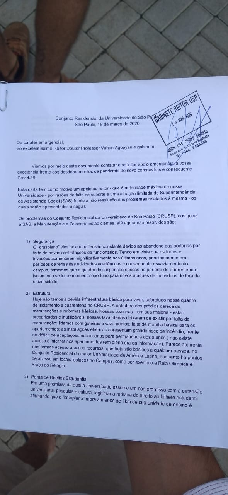

<!--
Em href="" colocar dentro das aspas o link
do arquivo seja no drive ou no próprio github
LEMBRE-SE SEMPRE DE TORNÁ-LO PÚBLICO
-->

## Cartas
<ul>
	<li>Carta ao reitor Vahan Agopyan e gabinete</li>
	<b>[19/03/2020]</b>
	
Carta protocolada pelos moradores do Bloco F do CRUSP em meio à quarentena do COVID-19 "por razões de falta de suporte e uma atuação limitada da Superintendência de Assistência Social (SAS) frente a não resolução dos problemas relatados à mesma".

	<ul>
		<li><a href="https://drive.google.com/open?id=1r1KNRLiOqFpINm9027zI-j36EMauxwSM" target="_blank">Carta ao Reitor [alt F4]</a></li>
		

			

			

		

	</ul>
	

	<li>Carta à FEA (docentes e diretor Fábio Frezatti)</li>
	<b>[19/03/2020]</b>
	
Carta aberta assinada por 11 discentes e moradores do CRUSP em meio à quarentena do COVID-19 "por objetivo elucidar a real situação enfrentada por nós, alunos da FEA que residimos no Conjunto Residencial da USP (CRUSP) de modo a deixar claro a vulnerabilidade a qual estamos expostos".

	<ul>
		<li><a href="https://drive.google.com/open?id=1A5d8OMffGuRoEbMazpvRVR98j4wH-xL0" target="_blank">Carta à FEA</a></li>
	</ul>
	

	<li>Carta à mídia</li>
	<b>[22/03/2020]</b>
	
"Nós, moradores do CRUSP, viemos solicitar medidas imediatas e em caráter de urgência com relação a pandemia do novo Corona Vírus/COVID-19".

	<ul>
		<li><a href="https://drive.google.com/open?id=1J8PdplpnlIPub8qlrdgFfzr-Hn1y-2fh" target="_blank">Carta à mídia</a></li>
	</ul>
	

	<li>Informe do Bloco F</li>
	<b>[24/03/2020]</b>
	
As cartas protocoladas na reitoria e na SAS não foram respondidas pela instituição, houveram mais tentativas de protocolar documentos relatando nossa sitação e pedindo melhorarias, isto aponta total negligência da USP para com os moradores do CRUSP.

	<ul>
		<li><a href="https://drive.google.com/file/d/1J49--0n9d1rafAqJp8dLx4sfVNywwD9T/preview" target="_blank">Informes Bloco F</a></li>
	</ul>
	

	<li>Carta aos docentes</li>
	<b>[26/03/2020]</b>
	
Carta das moradoras e moradores do CRUSP aos docentes da Universidade de São Paulo, se posicionando contra
	a manutenção do semestre em EAD, pedindo a devida suspensão imediata dessa modalidade.

	<ul>
		<li><a href="https://drive.google.com/open?id=1TXbsgAS9S5I2P5OEaJF0nuIjhZ4mUFYY" target="_blank">Carta aos docentes</a></li>
	</ul>
</ul>

## Emails
<ul>
	<li>Emails à SAS</li>
	<b>[03-20/03/2020]</b>
	
Notas de esclarecimentos e respostas da Superintendencia de Assistencia Social (SAS) aos moradores do CRUSP em resposta dos pedidos de esclarecimento dos estudantes no contexto de pandemia.

	<ul>
		<li><a href="https://drive.google.com/file/d/1o934nJMxlLpLmxY1qYJCJY4V0Ro7w_p7/preview" target="_blank">Acolhimento do CRUSP no enfrentamento ao coronavírus.</a></li>
		<li><a href="https://drive.google.com/file/d/1RVBvHMvWdDMas9EqIe9lliWbyumjDOHe/preview" target="_blank">Esclarecimento à Comunidade sobre o Coronavírus (COVID-19)</a></li>
		<li><a href="https://drive.google.com/open?id=1dhCL_zpO66KoXs3AxLu22G6A0GtX4-V8" target="_blank">Informe da SAS aos moradores do CRUSP</a></li>
		<li><a href="https://drive.google.com/open?id=1Mci3q5kwl67KseSzEs-ZlR4in_Uqw3xd" target="_blank">Informe da SAS aos moradores(as) do CRUSP</a></li>
		<li><a href="https://drive.google.com/open?id=1UAF9udSf1Pa6QaiGZ0c-nUSlm7h6t1HC" target="_blank">Levantamento Urgente Visando Ações Emergenciais no CRUSP</a></li>
		<li><a href="https://drive.google.com/open?id=19O7nu9HjL-HjnN8xpfQSQzO0FI30Du2t" target="_blank">Nota de esclarecimento aos moradores do CRUSP</a></li>
		<li><a href="https://drive.google.com/open?id=1UVUWtM3dr6c3tRhqd2PNYy-gK8VFgW2d" target="_blank">SAS - Moradores(as) do CRUSP</a></li>
	</ul>
</ul>

## Notícias
<ul>
	<li>Estadão</li>
	<b>[28/03/2020]</b>
	
Notícia do jornal Estadão - "Alunos que moram na USP temem o avanço do coronavírus por falta de estrutura e condições de higiene".

	<ul>
		<li><a href="https://saude.estadao.com.br/noticias/geral,alunos-que-moram-na-usp-temem-avanco-do-coronavirus-por-falta-de-estrutura-e-condicoes-de-higiene,70003252067?utm_source=estadao:whatsapp&utm_medium=link" target="_blank">Sem internet, também não sabem como continuarão a assistir às aulas e a fazer provas</a></li>
	</ul>
	<li>UOL</li>
	<b>[28/03/2020]</b>
	
Notícia do jornal UOL - "Aluno da USP morre por covid-19; moradores do CRUSP recebem kit de limpeza".

	<ul>
		<li><a href="https://noticias.uol.com.br/saude/ultimas-noticias/redacao/2020/03/28/usp-confirma-morte-em-hospital-universitario-por-coronavirus.htm" target="_blank">Em situação de pandemia, morre o primeiro aluno da USP, e cruspianos temem pela infraestrutura da moradia estudantil</a></li>
	</ul>
	<li>OGlobo</li>
	<b>[23/03/2020]</b>
	
Notícia do jornal OGlobo - "Estudantes de baixa renda relatam precariedade em alojamento universitário e temem pela própria saúde em meio à epidemia de Covid-19 em São Paulo".

	<ul>
		<li><a href="https://oglobo.globo.com/sociedade/coronavirus-estamos-completamente-abandonados-aqui-dizem-alunos-que-moram-na-usp-24323012?fbclid=IwAR1iV4bvVxpBZF99mNhjWG81dfSfh7PjHh5p7JGOyZkGlirLLtmQQV5XNh8" target="_blank">Coronavírus: 'Estamos completamente abandonados aqui', dizem alunos que moram na USP</a></li>
	</ul>
</ul>

<ul>
	<li>ig - Ultimo Segundo</li>
	<b>[23/03/2020]</b>
	
Notícia do jornal IG - Ultimo Segundo - "Alunos de baixa renda relatam precariedade na moradia da Universidade e temem pela saúde em meio ao surto da doença em São Paulo".

	<ul>
		<li><a href="https://ultimosegundo.ig.com.br/educacao/2020-03-23/estamos-completamente-abandonados-aqui-dizem-estudantes-que-moram-na-usp.html" target="_blank">Coronavírus: 'Estamos completamente abandonados aqui', dizem alunos que moram na USP</a></li>
	</ul>
</ul>

<ul>
	<li>Adusp</li>
	<b>[23/03/2020]</b>
	
Notícia da Adusp - "Estudantes que moram no Crusp cobram da Reitoria medidas urgentes contra a epidemia".

	<ul>
		<li><a href="https://www.adusp.org.br/index.php/defesauniv/3596-estudantes-que-moram-no-crusp-cobram-da-reitoria-medidas-urgentes-contra-a-epidemia" target="_blank">Situação é crítica: os blocos necessitam de iluminação e reparos de todo tipo nas cozinhas e lavanderias e a maioria dos apartamentos não tem wi-fi. Além disso, falta segurança</a></li>
	</ul>
</ul>

<ul>
	<li>Yahoo</li>
	<b>[23/03/2020]</b>
	
Entrevista ao jornal Yahoo sobre o que enfrentamos no CRUSP.

	<ul>
		<li><a href="https://br.noticias.yahoo.com/coronavirus-estudantes-de-baixa-renda-que-moram-na-usp-relatam-abandono-em-meio-a-pandemia-140538167.html" target="_blank">"Parece meio distópico, meio Bacurau, mas essa é a realidade em que a gente vive”</a></li>
	</ul>
	<li>CBN</li>
	<b>[23/03/2020]</b>
	
Entrevista a CBN sobre o que enfrentamos no CRUSP.

	<ul>
		<li><a href="https://cbn.globoradio.globo.com/media/audio/295887/alunos-da-usp-reclamam-de-precariedade-no-conjunto.htm" target="_blank">"Alunos da USP reclamam de precariedade no conjunto residencial da universidade”</a></li>
	</ul>
</ul>

