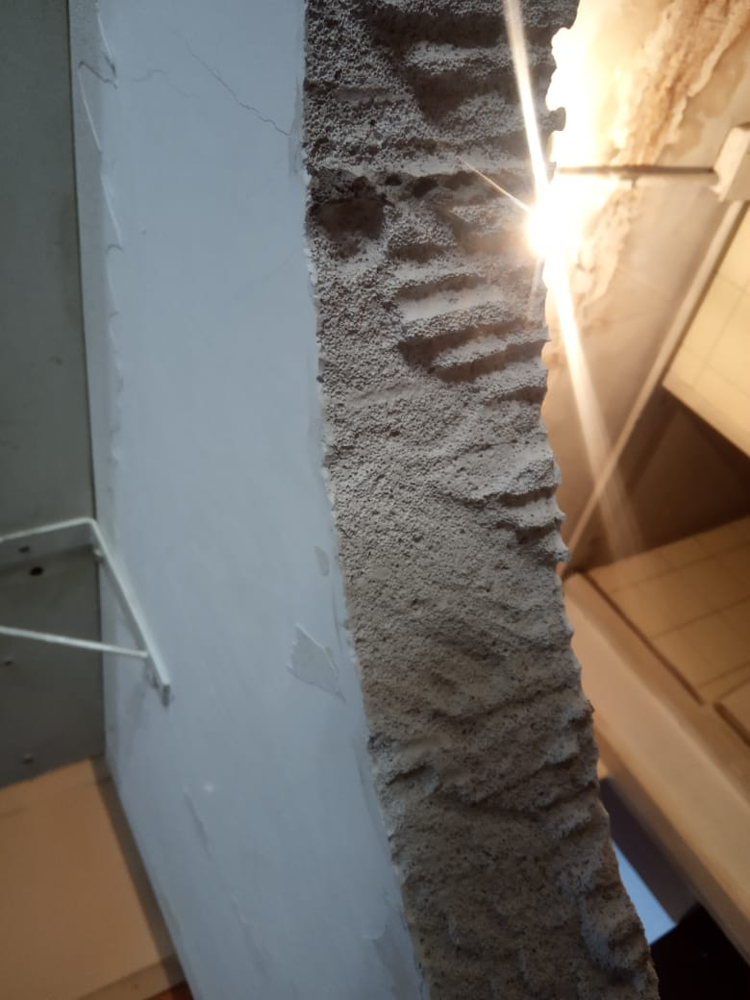
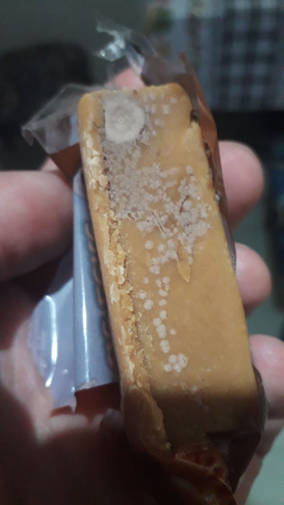
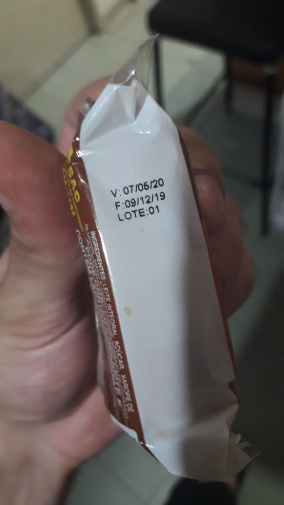
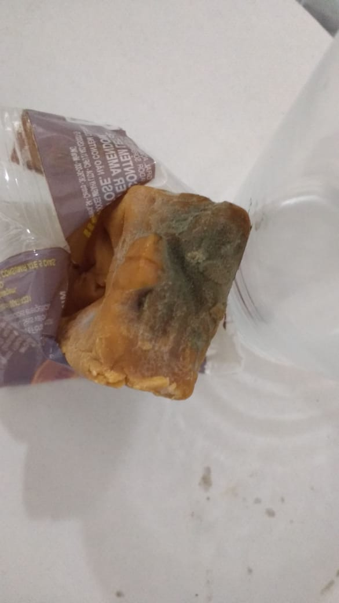
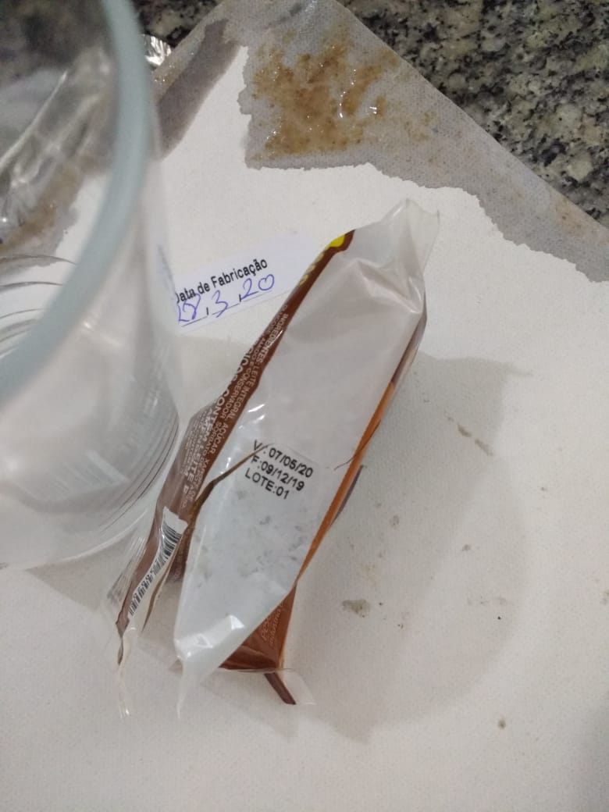

<!--
Em href="" colocar dentro das aspas o link
do arquivo seja no drive ou no próprio github
LEMBRE-SE SEMPRE DE TORNÁ-LO PÚBLICO
-->

## CRUSP BLOCO F

* <a href=".\imagens\blocoF\andar1">1o andar</a>
* <a href=".\imagens\blocoF\andar2">2o andar</a>
* <a href=".\imagens\blocoF\andar3">3o andar</a>
* <a href=".\imagens\blocoF\andar4">4o andar</a>
* <a href=".\imagens\blocoF\andar5">5o andar</a>
* <a href=".\imagens\blocoF\andar6">6o andar</a>

## PAREDES DO CRUSP
<b>[23/03/2020]</b>

O quão grossas são as paredes do CRUSP ?

## ALIMENTOS ESTRAGADOS

Relatos de alimentos estragados distribuídos pela empresa terceirizada responsável pelas marmitas

<b>[01/04/2020]</b>

<b>[28/03/2020]</b>

