

<link rel="stylesheet" href="https://cdnjs.cloudflare.com/ajax/libs/ekko-lightbox/5.3.0/ekko-lightbox.css" integrity="sha256-HAaDW5o2+LelybUhfuk0Zh2Vdk8Y2W2UeKmbaXhalfA=" crossorigin="anonymous" />

<!-- 
Em href="" colocar dentro das aspas o link 
do arquivo seja no drive ou no próprio github
LEMBRE-SE SEMPRE DE TORNÁ-LO PÚBLICO
-->

## CRUSP BLOCO F
### 1o ANDAR

<b>[22/03/2020]</b>

	

		

			
		

	

	

	
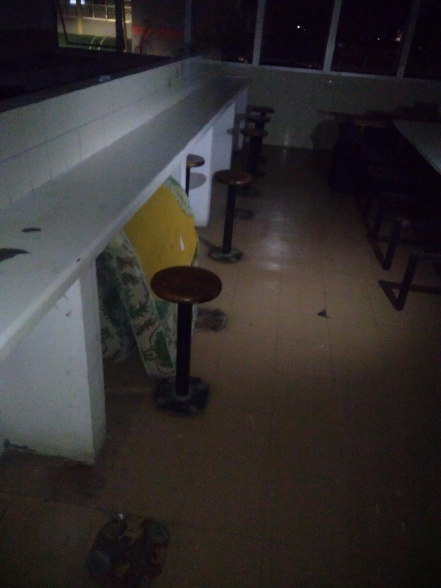

	

	

	
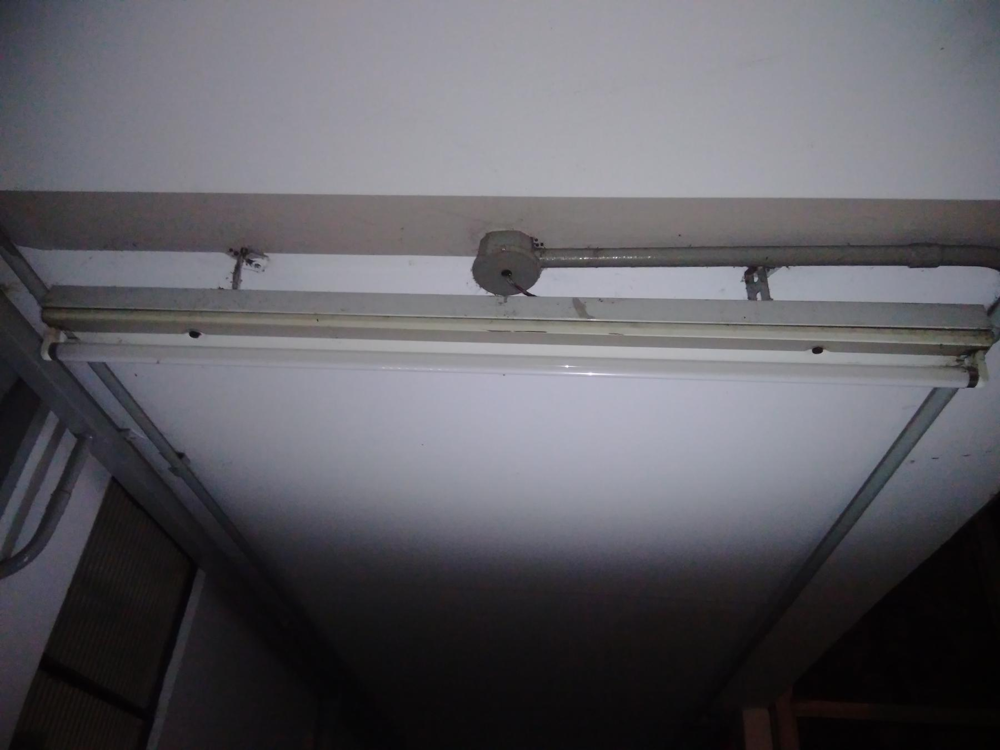

	
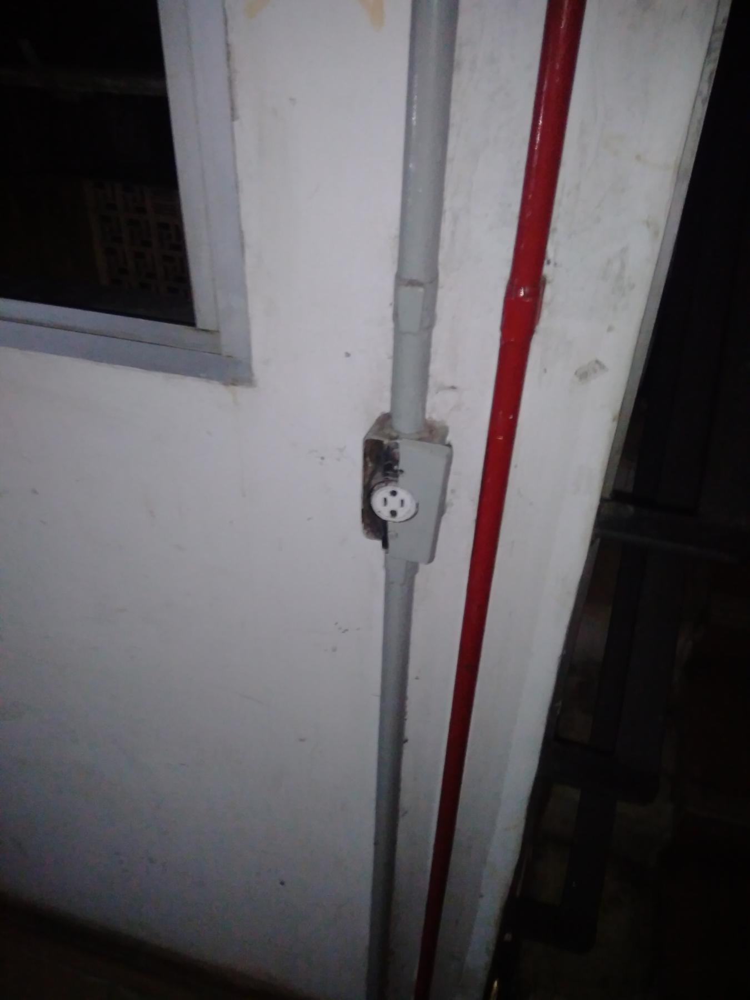

	
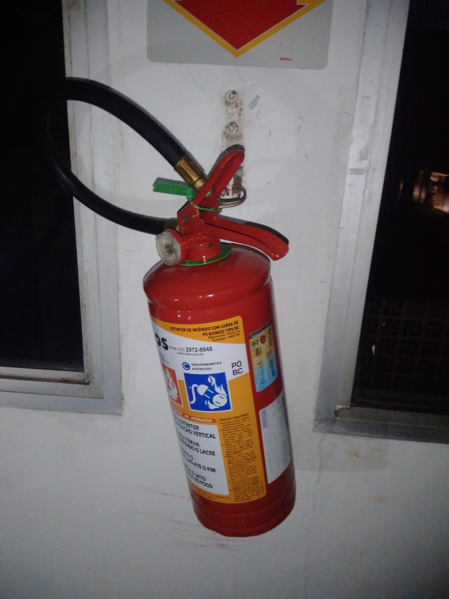

	
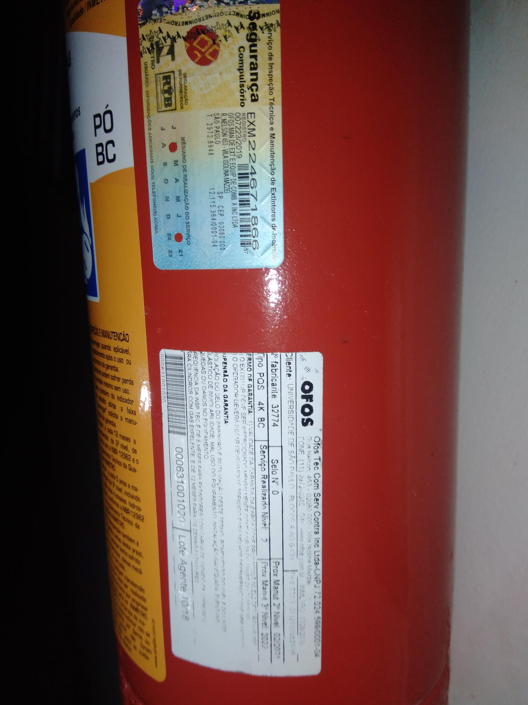

	
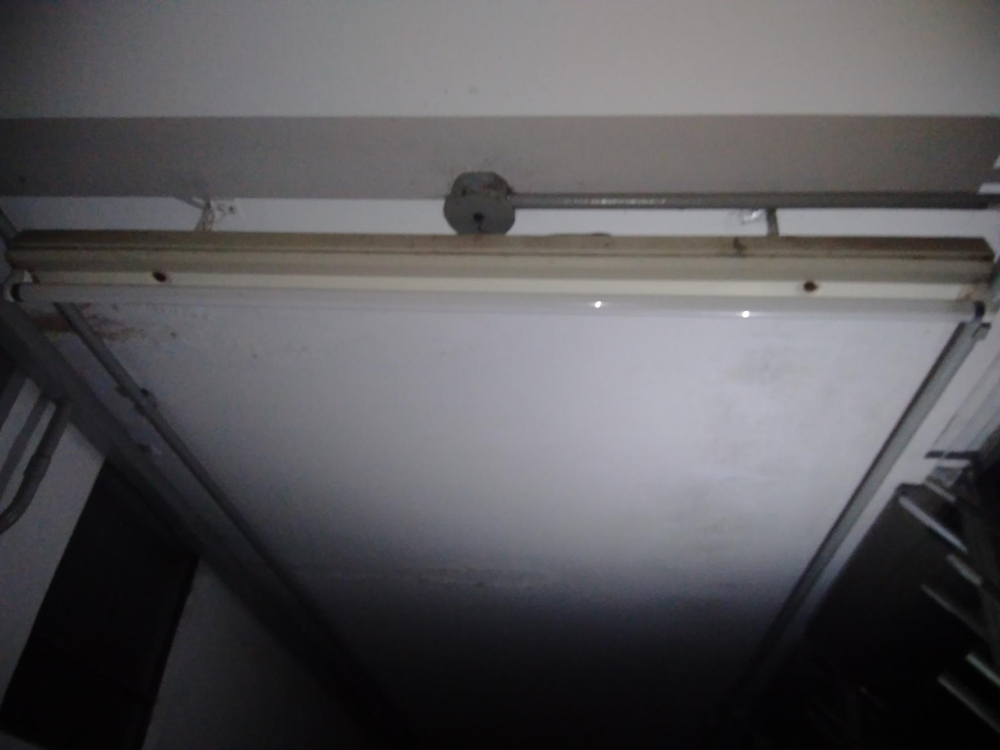

	

	

	

	
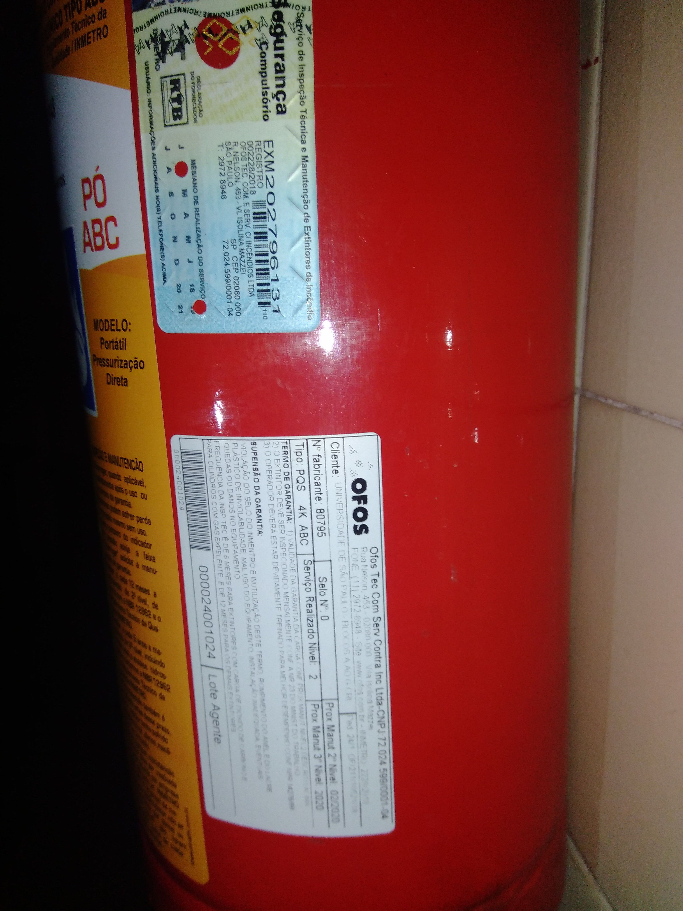

	
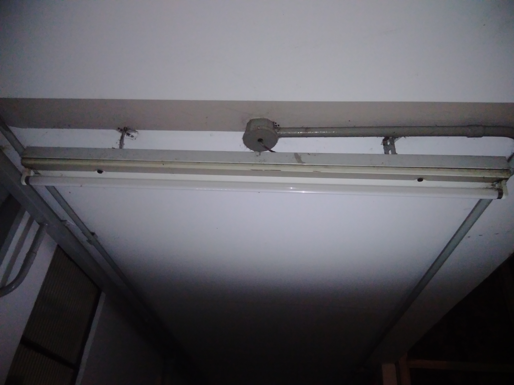

	
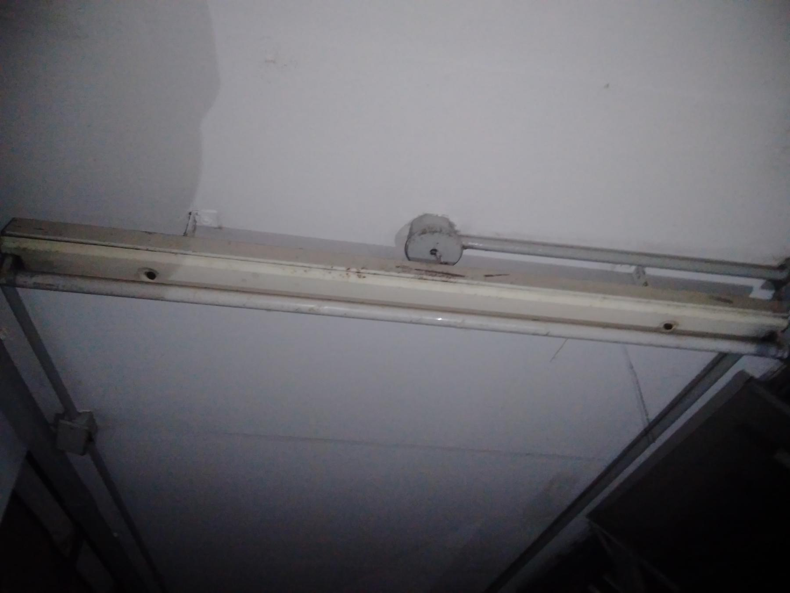

	

	
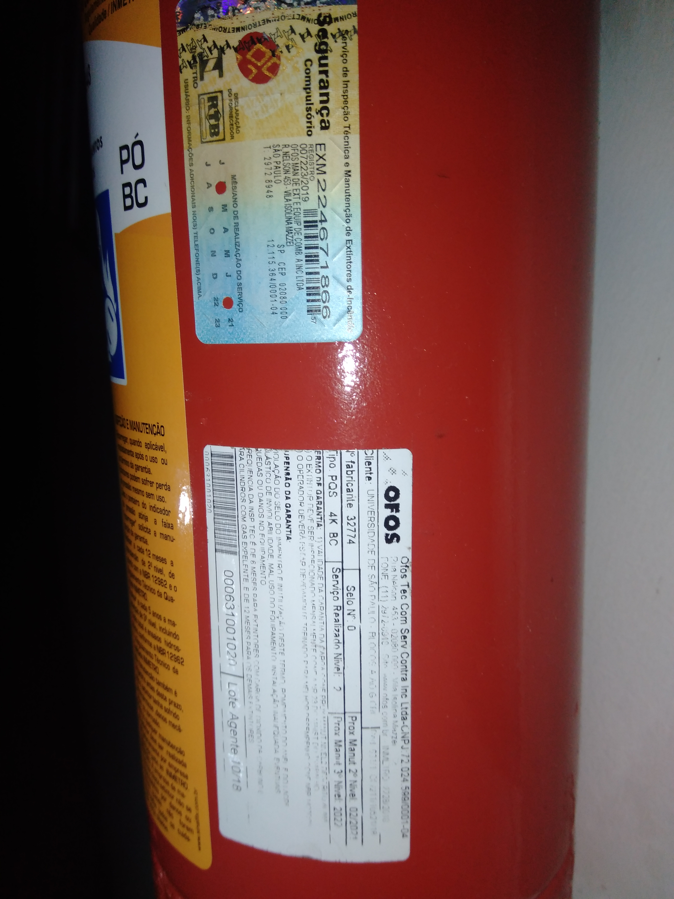

	
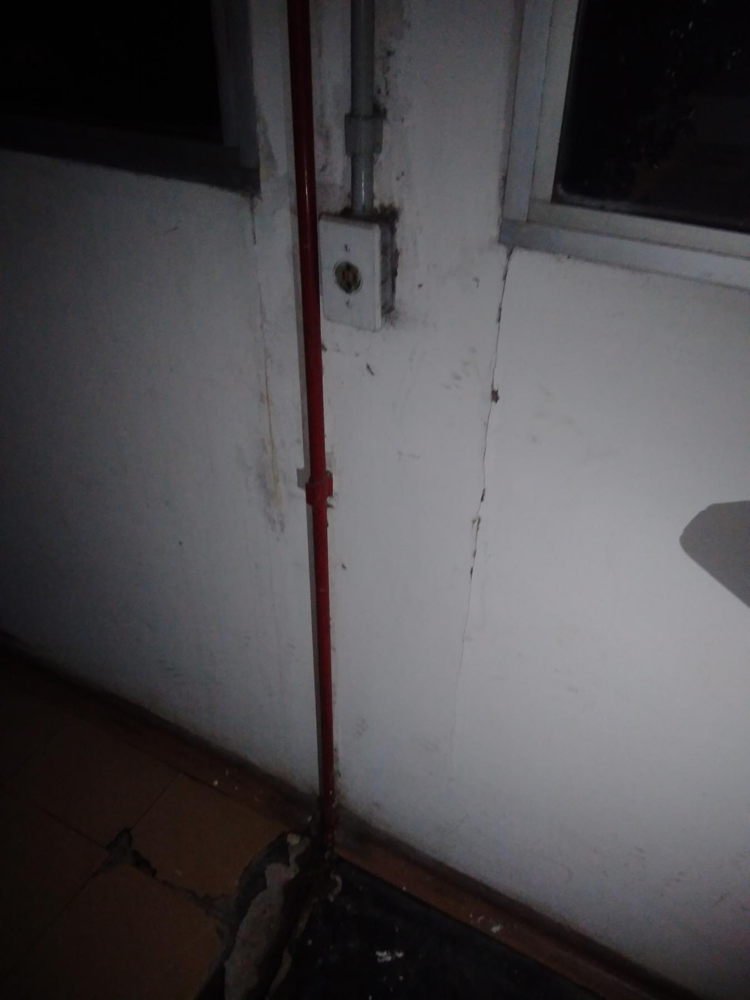

	

	
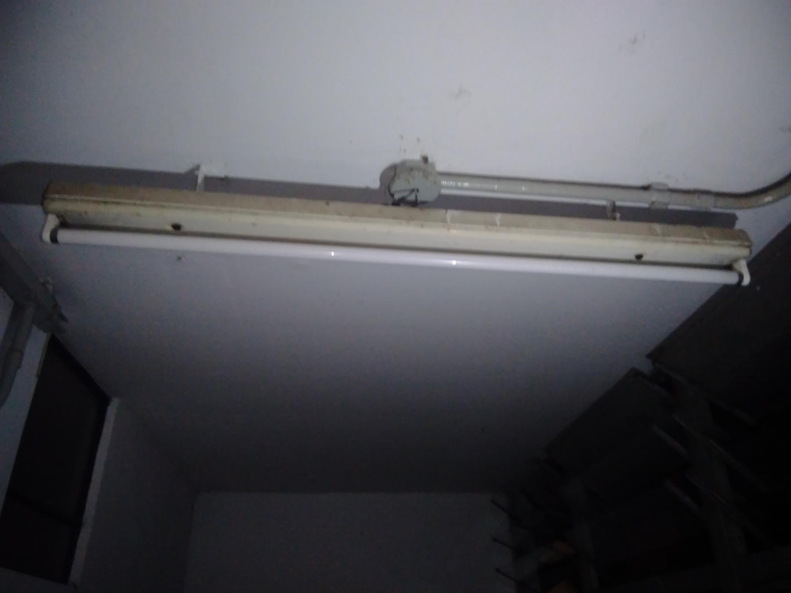

