<!-- 
Em href="" colocar dentro das aspas o link 
do arquivo seja no drive ou no próprio github
LEMBRE-SE SEMPRE DE TORNÁ-LO PÚBLICO
-->

## CRUSP BLOCO F
### 5o ANDAR

	

	

	
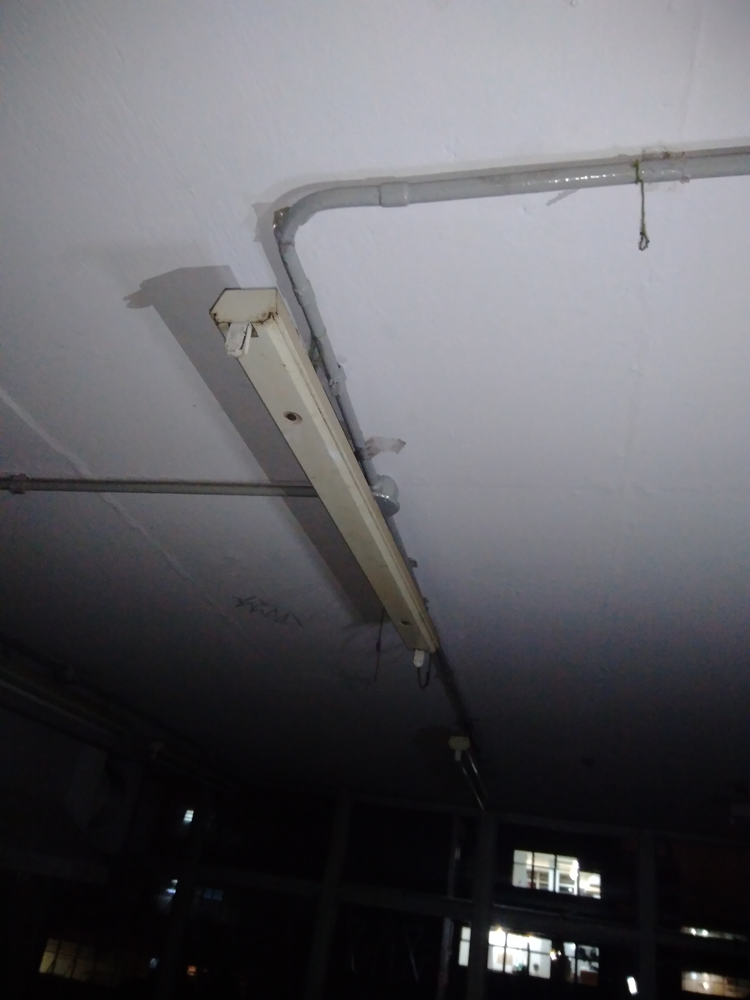

	
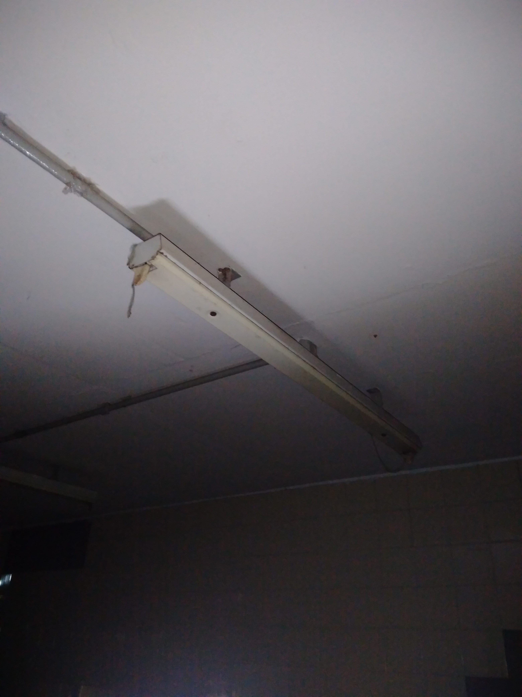

	
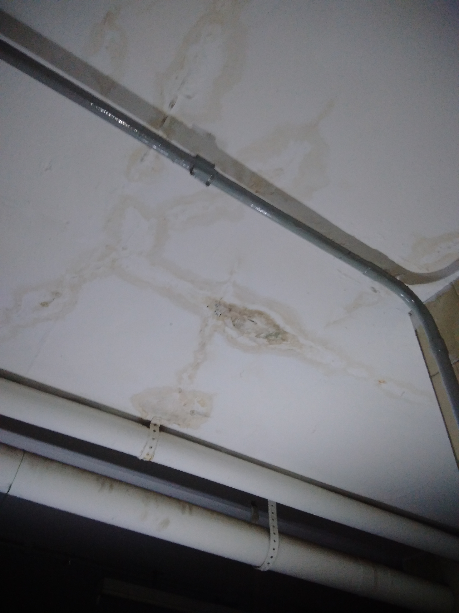

	

	
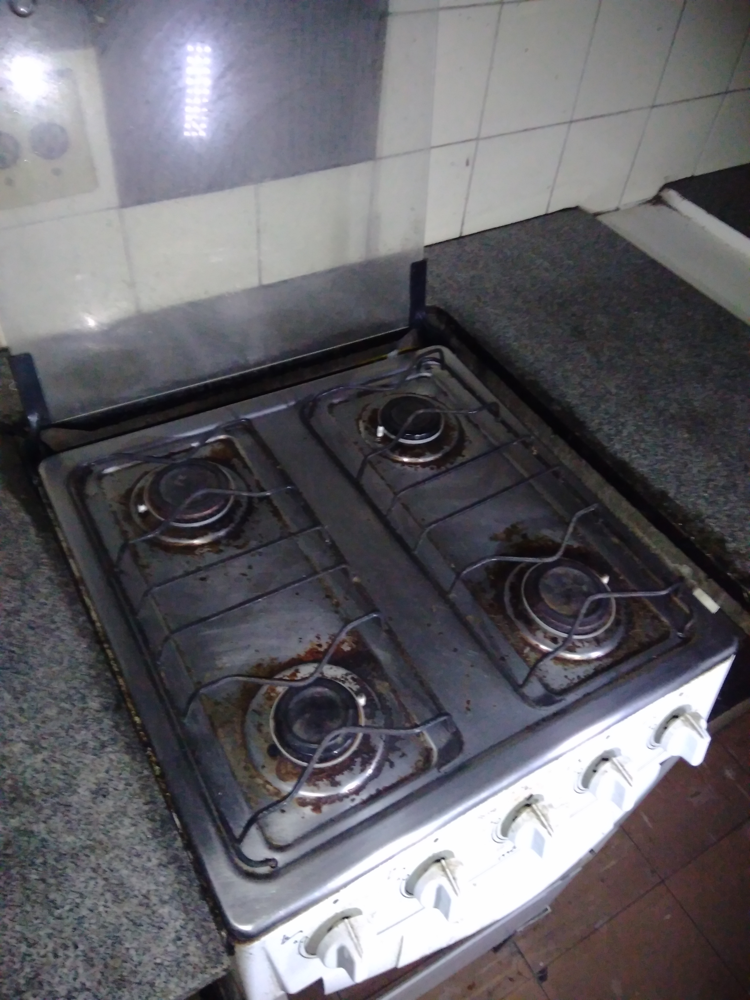

	
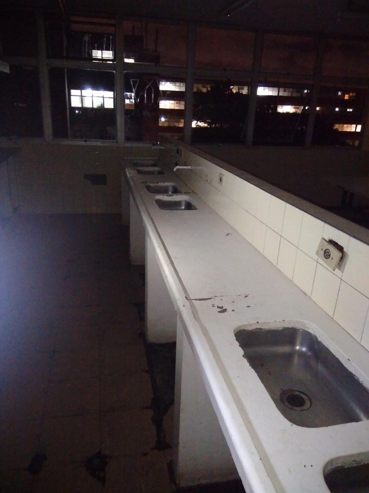

	

	
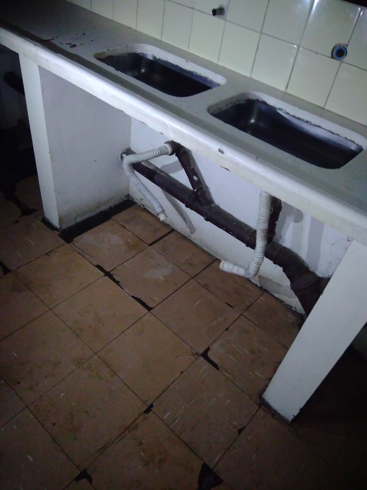

	
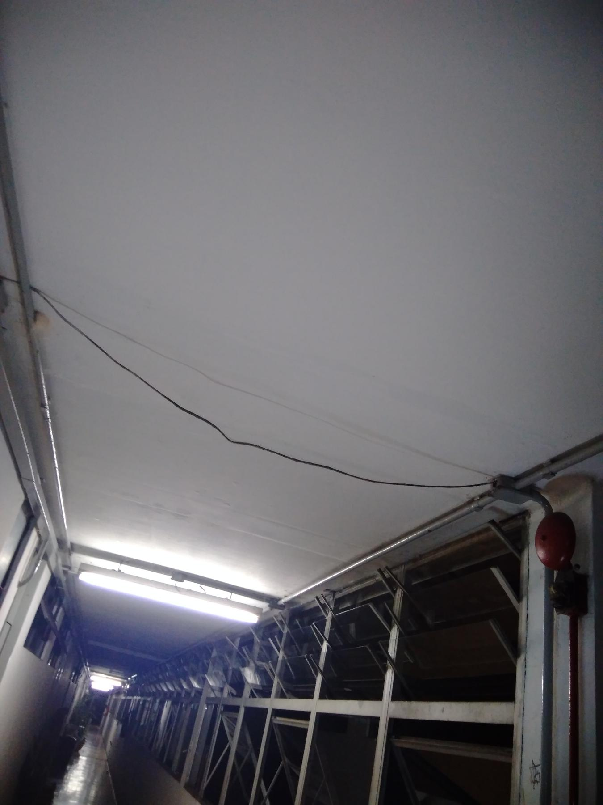

	
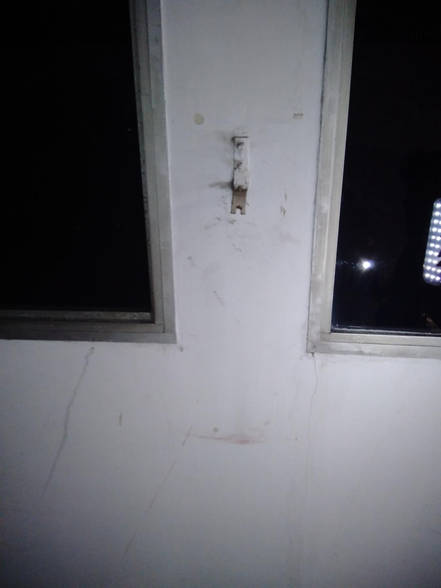

	
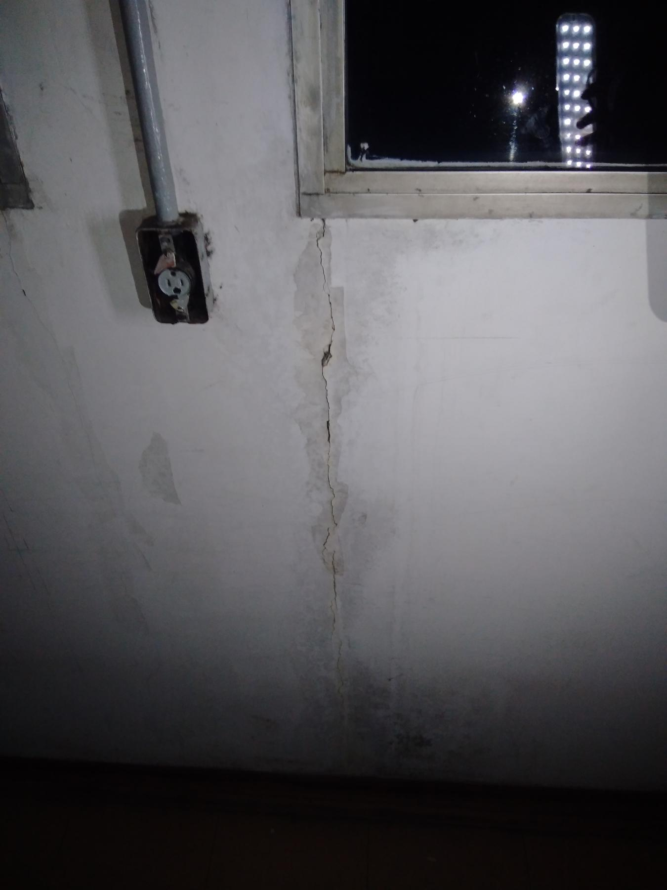

	
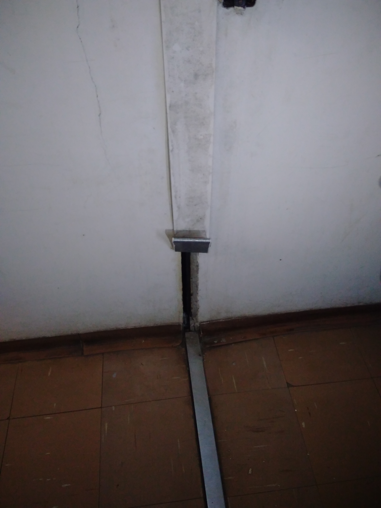

	
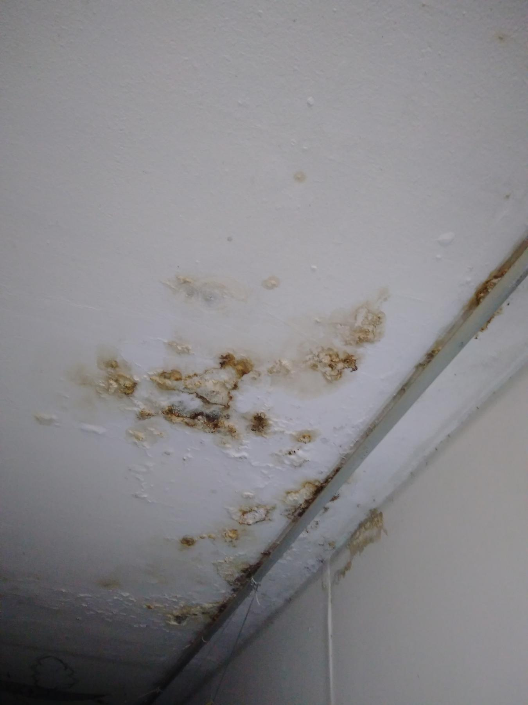

