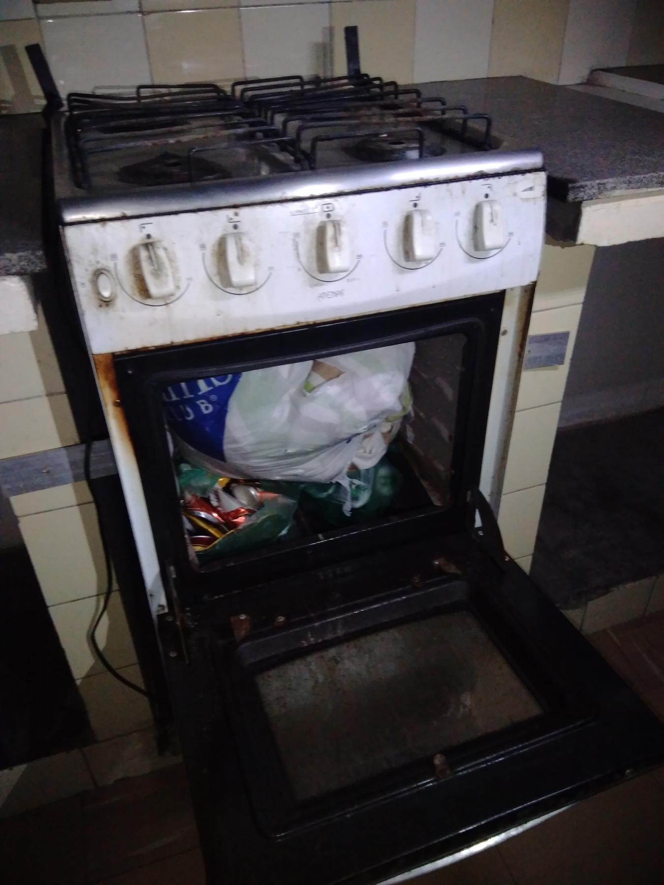

<!-- 
Em href="" colocar dentro das aspas o link 
do arquivo seja no drive ou no próprio github
LEMBRE-SE SEMPRE DE TORNÁ-LO PÚBLICO
-->

## CRUSP BLOCO F
### 6o ANDAR

<b>[22/03/2020]</b>

	

		

			
			
			
		

	

	

		

			
			
			
		

	

	

		

			
			
			
		

	

	

		

			
			
			
		

	

	

		

			
			
			
		

	

